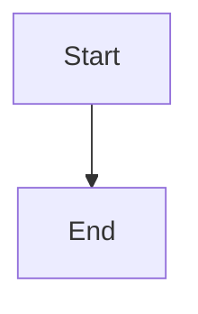

# Accessibility Features in Mermaid

Mermaid provides several accessibility features to make your diagrams more inclusive and compatible with screen readers. This guide will explain how to use these features effectively.

## Adding Titles and Descriptions to Diagrams

Mermaid allows you to add accessible titles and descriptions to your diagrams, which are particularly useful for screen readers. These are added using the `addSVGa11yTitleDescription` function.

### How to Add Titles and Descriptions

The `addA11yInfo` function is used internally to add accessibility information to the diagram. It takes four parameters:

1. `diagramType`: The type of diagram (e.g., 'flowchart', 'sequenceDiagram', etc.)
2. `svgNode`: The D3 node representing the SVG element
3. `a11yTitle`: The accessible title for the diagram
4. `a11yDescr`: The accessible description for the diagram

Here's an example of how this function is used internally:

```javascript
function addA11yInfo(
  diagramType: string,
  svgNode: D3Element,
  a11yTitle?: string,
  a11yDescr?: string
): void {
  setA11yDiagramInfo(svgNode, diagramType);
  addSVGa11yTitleDescription(svgNode, a11yTitle, a11yDescr, svgNode.attr('id'));
}
```

### Setting Accessibility Information in Your Diagrams

While you don't need to call these functions directly, you can set the accessibility title and description in your diagram code using the `accTitle` and `accDescr` directives. Here's an example:



## Automatic Accessibility Enhancements

Mermaid automatically enhances the accessibility of your diagrams in several ways:

1. **SVG Attributes**: The SVG element is given appropriate ARIA (Accessible Rich Internet Applications) attributes to identify it as a diagram.

2. **Diagram Type**: The type of diagram is included in the accessibility information, helping screen reader users understand what kind of visual representation they're encountering.

3. **Element IDs**: Each SVG element is given a unique ID, which can be used by assistive technologies to navigate the diagram.

## Best Practices for Accessible Diagrams

To make your Mermaid diagrams as accessible as possible:

1. Always include an `accTitle` and `accDescr` in your diagram code. The title should be brief and descriptive, while the description can provide more detail about the diagram's content and purpose.

2. Use clear and concise labels for nodes and connections in your diagrams.

3. Avoid relying solely on color to convey information. Use shapes, patterns, or text to differentiate elements when possible.

4. Keep your diagrams as simple as possible while still conveying the necessary information.

5. If your diagram is complex, consider breaking it down into multiple simpler diagrams.

## Technical Implementation

For developers interested in the technical details:

- The `addSVGa11yTitleDescription` function is responsible for adding the `<title>` and `<desc>` elements to the SVG, which provide the accessible name and description.

- The `setA11yDiagramInfo` function sets additional ARIA attributes on the SVG element to identify it as a diagram and specify its type.

- These functions are called automatically when rendering diagrams, so diagram creators don't need to worry about implementing them directly.

By utilizing these accessibility features, you can ensure that your Mermaid diagrams are more inclusive and usable for all users, including those relying on assistive technologies.