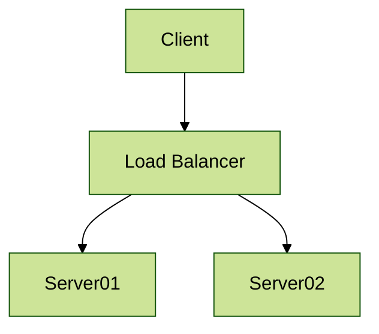

# Mermaid Configuration Options

Mermaid provides a wide range of configuration options to customize the appearance and behavior of your diagrams. This page provides a comprehensive list of all available configuration options, their default values, possible settings, and how they affect diagram rendering.

## Table of Contents

1. [Setting Configuration](#setting-configuration)
2. [Global Configuration](#global-configuration)
3. [Theme Configuration](#theme-configuration)
4. [Diagram-Specific Configuration](#diagram-specific-configuration)
5. [Security Configuration](#security-configuration)

## Setting Configuration

Mermaid offers several ways to set configuration options:

1. **Global configuration**: Set options for all diagrams using `mermaid.initialize()`.
2. **Per-diagram configuration**: Set options for a specific diagram using the `%%{init: {}}%%` directive.
3. **Runtime configuration**: Modify options dynamically using the `mermaid.setConfig()` function.

Example of setting global configuration:

```javascript
mermaid.initialize({
  theme: 'forest',
  logLevel: 'error',
  securityLevel: 'strict',
  startOnLoad: true
});
```

Example of per-diagram configuration:



## Global Configuration

These options affect all diagrams and the overall behavior of Mermaid.

| Option | Description | Default | Possible Values |
|--------|-------------|---------|-----------------|
| `theme` | Set the theme for all diagrams | `'default'` | `'default'`, `'forest'`, `'dark'`, `'neutral'`, `'base'` |
| `startOnLoad` | Toggle automatic rendering of diagrams on page load | `true` | `true`, `false` |
| `securityLevel` | Set the security level for scripts in diagrams | `'strict'` | `'strict'`, `'loose'`, `'antiscript'` |
| `logLevel` | Set the logging level | `'error'` | `'debug'`, `'info'`, `'warn'`, `'error'`, `'fatal'` |
| `arrowMarkerAbsolute` | Define if arrow markers in html code are absolute paths | `false` | `true`, `false` |

## Theme Configuration

Mermaid allows extensive theme customization through the `themeVariables` option. You can override specific theme variables to adjust colors, fonts, and other styling properties.

Example:

```javascript
mermaid.initialize({
  theme: 'base',
  themeVariables: {
    primaryColor: '#ff0000',
    primaryTextColor: '#ffffff',
    primaryBorderColor: '#7C0000',
    lineColor: '#F8B229',
    secondaryColor: '#006100',
    tertiaryColor: '#fff'
  }
});
```

For a complete list of theme variables, refer to the theme definitions in the Mermaid source code.

## Diagram-Specific Configuration

Some configuration options are specific to certain diagram types. Here are a few examples:

### Flowchart

| Option | Description | Default | Possible Values |
|--------|-------------|---------|-----------------|
| `flowchart.htmlLabels` | Use HTML labels for rendering. If false, the fallback is SVG-based rendering | `true` | `true`, `false` |
| `flowchart.curve` | Defines the curve used to connect nodes | `'basis'` | `'basis'`, `'linear'`, `'cardinal'` |

### Sequence Diagram

| Option | Description | Default | Possible Values |
|--------|-------------|---------|-----------------|
| `sequence.diagramMarginX` | Margin to the right and left of the sequence diagram | 50 | Positive integers |
| `sequence.diagramMarginY` | Margin to the top and bottom of the sequence diagram | 10 | Positive integers |
| `sequence.actorMargin` | Margin between actors | 50 | Positive integers |

### Gantt Chart

| Option | Description | Default | Possible Values |
|--------|-------------|---------|-----------------|
| `gantt.titleTopMargin` | Margin top for the text over the gantt diagram | 25 | Positive integers |
| `gantt.barHeight` | The height of the bars in the graph | 20 | Positive integers |
| `gantt.barGap` | The margin between the different activities in the gantt diagram | 4 | Positive integers |

## Security Configuration

Mermaid includes security options to prevent potential XSS attacks:

| Option | Description | Default | Possible Values |
|--------|-------------|---------|-----------------|
| `secure` | Array of functions to be sanitized | `['secure']` | Array of function names |
| `securityLevel` | Sets the level of trust for the parsed diagram | `'strict'` | `'strict'`, `'loose'`, `'antiscript'` |

The `securityLevel` option affects how diagrams can be rendered:

- `'strict'`: Prevents adding clickable interactivity, sanitizes certain text.
- `'loose'`: Allows all rendering, including clickable interactivity.
- `'antiscript'`: Disables html tags in labels, sanitizes text, and prevents all rendering of clickable interactivity.

For more details on security configuration, refer to the Mermaid security documentation.

Remember that when setting configuration options, you should always sanitize user input and be cautious about using configuration values from untrusted sources.

For the most up-to-date and detailed information on configuration options, always refer to the official Mermaid documentation and source code.