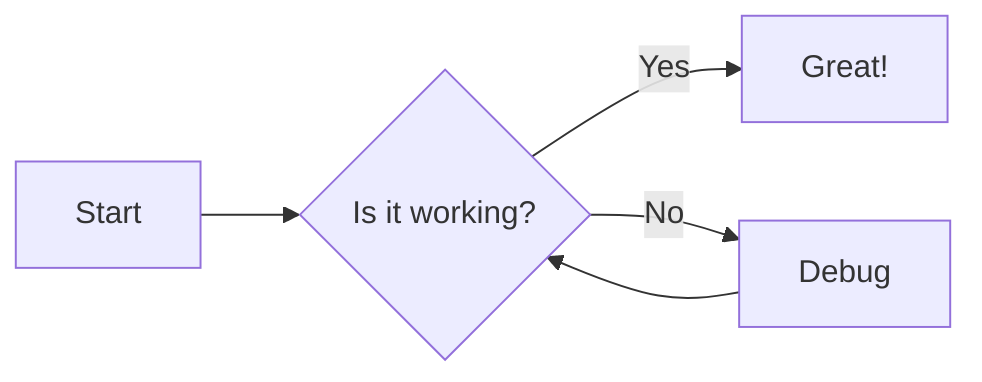
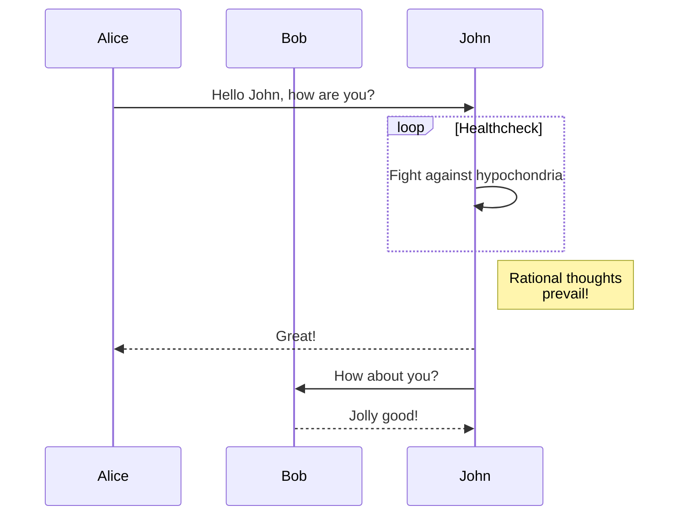
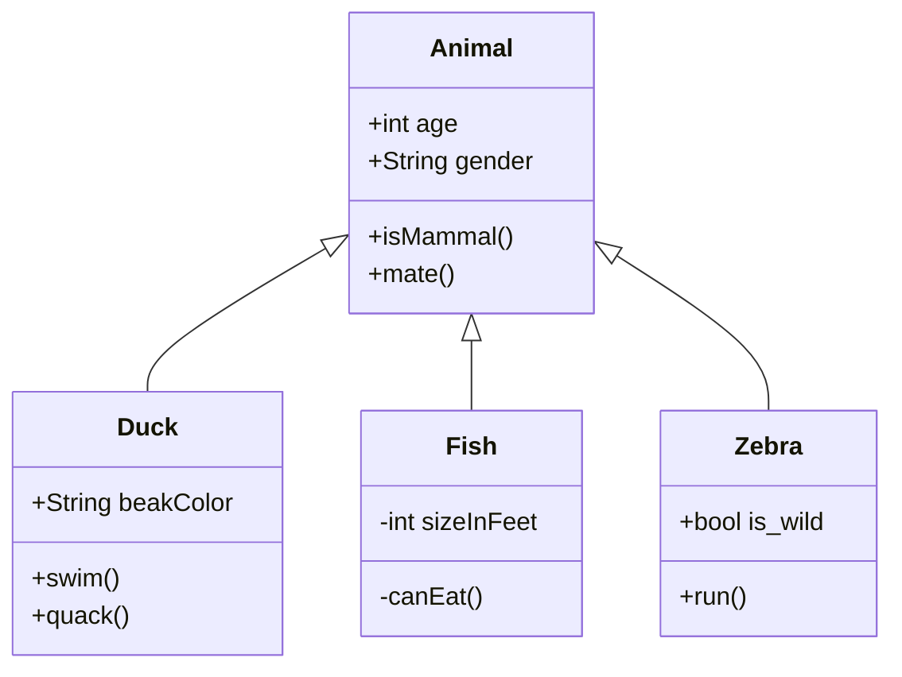

# Getting Started with Mermaid

Mermaid is a JavaScript-based diagramming and charting tool that renders Markdown-inspired text definitions to create and modify diagrams dynamically. This guide will help you get started with Mermaid in your project.

## Installation

You can use Mermaid in several ways:

### 1. CDN

Include the Mermaid library in your HTML file:

```html
<script src="https://cdn.jsdelivr.net/npm/mermaid/dist/mermaid.min.js"></script>
```

### 2. npm

If you're using a build system or module bundler, you can install Mermaid via npm:

```bash
npm install mermaid
```

Then import it in your JavaScript file:

```javascript
import mermaid from 'mermaid';
```

## Basic Usage

### 1. Initialize Mermaid

After including the library, initialize Mermaid:

```javascript
mermaid.initialize({ startOnLoad: true });
```

This tells Mermaid to parse and render all elements with the `mermaid` class when the page loads.

### 2. Create a Diagram

To create a diagram, add a `<div>` element with the `mermaid` class and include your diagram definition:

```html
<div class="mermaid">
  graph TD
    A[Start] --> B{Is it?}
    B -- Yes --> C[OK]
    C --> D[Rethink]
    D --> B
    B -- No ----> E[End]
</div>
```

### 3. Render Programmatically

You can also render diagrams programmatically:

```javascript
mermaid.render('mermaid', 'graph TD; A-->B;', (svgCode) => {
  document.getElementById('output').innerHTML = svgCode;
});
```

## Example Diagrams

Here are a few examples of different diagram types you can create with Mermaid:

### Flowchart



### Sequence Diagram



### Class Diagram



## Configuration

You can configure Mermaid's behavior and appearance using the `initialize` function:

```javascript
mermaid.initialize({
  startOnLoad: true,
  theme: 'forest',
  logLevel: 'fatal',
  securityLevel: 'strict',
  flowchart: { curve: 'basis' },
  gantt: { axisFormat: '%m/%d/%Y' },
  sequence: { actorMargin: 50 },
});
```

## Next Steps

To learn more about Mermaid's capabilities and advanced usage:

1. Explore the [Mermaid documentation](https://mermaid-js.github.io/mermaid/#/) for detailed information on all diagram types and configurations.
2. Check out the [Mermaid Live Editor](https://mermaid-js.github.io/mermaid-live-editor/) to experiment with diagrams in real-time.
3. Join the [Mermaid community](https://github.com/mermaid-js/mermaid/discussions) to get help and share your creations.

Happy diagramming with Mermaid!